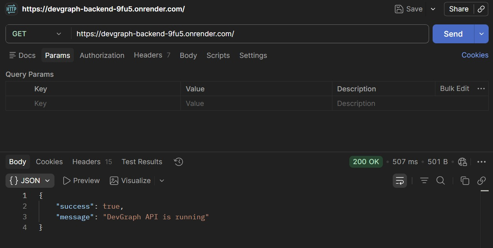
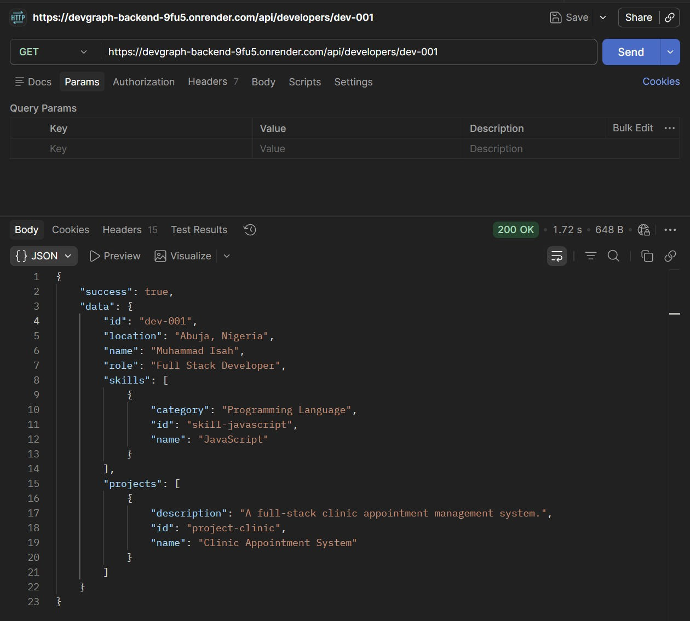
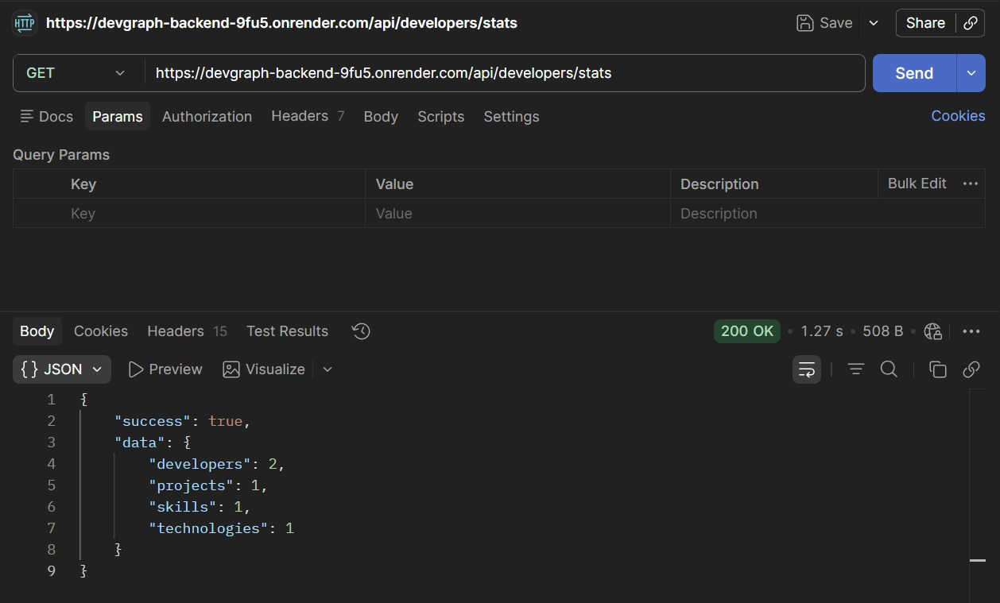

# DevGraph Backend

REST API for **DevGraph**, a developer relationship and technology graph application built with **Node.js, Express, and Neo4j**.

## Features

- View all developers
- View individual developer profiles
- View developer skills and projects
- View technologies used by developers
- Find developers with shared skills
- View graph statistics
- Neo4j graph database integration

## Tech Stack

- Node.js
- Express.js
- Neo4j
- Cypher
- neo4j-driver
- dotenv
- CORS

## Project Structure

```text
devgraph/
├── src/
│   ├── config/
│   │   └── database.js
│   ├── controllers/
│   │   └── developer.controller.js
│   ├── queries/
│   │   └── graph.queries.js
│   ├── routes/
│   │   └── developer.routes.js
│   ├── seed/
│   │   └── seed.js
│   └── server.js
├── .env
├── .gitignore
├── package.json
└── README.md

## API Endpoints

| Method | Endpoint | Description |
|---|---|---|
| GET | `/` | Check API status |
| GET | `/api/developers` | Get all developers |
| GET | `/api/developers/stats` | Get graph statistics |
| GET | `/api/developers/:id` | Get developer details |
| GET | `/api/developers/:id/technologies` | Get developer technologies |
| GET | `/api/developers/:id/connections` | Get developer connections |

### Example Request

```http
GET /api/developers/dev-001
```

### Example Response

```json
{
  "success": true,
  "data": {
    "id": "dev-001",
    "name": "Developer Name",
    "skills": [],
    "projects": []
  }
}
```

## Database

DevGraph uses **Neo4j** as its graph database.

The graph models relationships between developers, skills, projects, and technologies.

```text
Developer → Skill
Developer → Project → Technology
Developer ↔ Developer
```

This structure allows the API to find relationships such as developers with shared skills and technologies used across projects.

## Setup

### 1. Clone the repository

```bash
git clone <your-backend-repository-url>
cd devgraph
```

### 2. Install dependencies

```bash
npm install
```

### 3. Configure environment variables

Create a `.env` file in the project root:

```env
COGNODB_URI=your_neo4j_uri
COGNODB_USER=your_neo4j_username
COGNODB_PASSWORD=your_neo4j_password
PORT=5000
```

> Do not commit your `.env` file or database credentials to GitHub.

### 4. Seed the database

```bash
npm run seed
```

### 5. Start the development server

```bash
npm run dev
```

The API will be available at:

```text
http://localhost:5000
```

For production:

```bash
npm start
```

## Live API

[DevGraph Backend API](https://devgraph-backend-9fu5.onrender.com/)

## Screenshots

### API Status



### Developer API



### Graph Statistics



## Frontend

The DevGraph frontend is a separate React application that consumes this API and provides the user interface for exploring developers, skills, projects, technologies, and connections.

## Author

**Muhammad Isah**

Full Stack Developer

JavaScript • React • Node.js • Express • Neo4j

Built for the **CognoDB / Wexa AI technical assignment**.